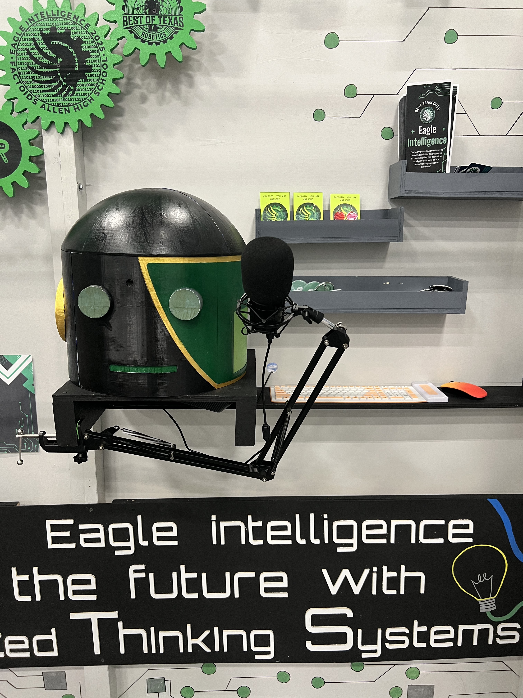

# Eve — customizable conversational robot

Eve connects a camera, microphone, speaker, and local AI models into a conversational robot. This open-source edition builds on the Allen High School Robotics project from the 2025 BEST Robotics Factoids season, with Eve as the default example persona.

Create another assistant by changing the Ollama persona and alias, selecting a voice, and connecting compatible hardware. The conversation software runs without a mouth mechanism.

## Features

- Face detection and recognition with OpenCV and face-recognition.
- Speech recognition with faster-whisper (`tiny.en`, CPU `int8` by default).
- Local responses through Ollama, using a customizable model and system prompt.
- Speech synthesis with Piper; Eve's example voice is `en_US-amy-low`.
- Visitor information and conversation history stored in SQLite.
- Optional serial commands for a controller implementing audio-driven mouth motion.

## Installation

Follow [INSTALL.md](INSTALL.md) to install the Python dependencies, Ollama, and Piper. The guide uses Eve as the example and includes instructions for another persona.

Python packages install together with:

```bash
python -m pip install -r requirements.txt
```

After completing setup, launch from the project root:

```bash
source .venv/bin/activate
python eve_main/main.py
```

The original hardware was a Jetson Orin Nano Developer Kit (8 GB) running Ubuntu, a USB webcam, microphone, and speaker. Equivalent Linux-compatible peripherals can be used. The original installation worked during competition, but its package-version records and Ollama Modelfile were not retained at handoff. The customizable edition has not yet been tested on a fresh Jetson installation.

## Make it your own

| Change | Where |
| --- | --- |
| Base model, persona, response settings | `FROM`, `SYSTEM`, and `PARAMETER` in [Modelfile](Modelfile) |
| Ollama alias | `ollama create <alias> -f Modelfile`, then `MODEL_NAME` in [config.py](eve_main/config.py) |
| Display name | `ROBOT_NAME` in `eve_main/config.py` |
| Voice and Piper executable | `PIPER_VOICE` and `PIPER_BIN` in `eve_main/config.py` |
| Database file | `DB_NAME`; defaults to `face_recognition.db` |
| Camera | Camera index in `eve_main/main.py` |
| Conversation and onboarding behavior | `eve_main/flow.py` and `eve_main/main.py` |
| Optional mouth hardware | Serial settings in `config.py`, envelope limits in `audio.py`, and matching controller firmware |

By default, the Modelfile controls the persona. `BASE_SYSTEM_PROMPT` is an optional Python override and is set to `None`. The edited application no longer forces the Eve identity during onboarding.

The database is created automatically. [DB Browser for SQLite](https://sqlitebrowser.org/) can inspect visitor records and conversation history; see the installation guide for editing instructions.

## Booth demonstration and project history



[Watch the booth clip (26 seconds)](media/booth-demo.mp4): part of the Allen Eagle Robotics booth interaction with Nicolas Powell and Gerard Andrews.

The competition implementation used one Python script. After competition, it was split into eight modules and tested on the original setup. This edition adds configurable persona handling and installation documentation. The original script remains in `legacy/` as a historical reference and fallback with its original settings.

The demonstrated mouth ran an independent open/close animation on a Pico H, powered externally and manually switched on when visitors approached. It was not synchronized with speech. The Python serial-control interface is available for future implementations; controller firmware is not included.

Khai La developed the software and AI integration. [Nicolas Powell](https://www.linkedin.com/in/nicolas-powell-223590377/) completed the mechanical design, paint job, and mouth-servo wiring to the Pico.
## Development

The application is in `eve_main/`; `main.py` is the entry point. `tests/` contains source and simulated conversation checks, including custom-persona request handling.

In VS Code, use **File → Open Folder** to open the inner `Eve` folder containing this README, `eve_main/`, and `tests/`. Then select **Terminal → New Terminal**. Run the following in that terminal, from the project root:

```bash
python3 -m unittest discover -s tests -v
```

On Windows with the Python launcher installed, use `py -m unittest discover -s tests -v` instead. A successful run ends with `Ran 7 tests` and `OK`; `Ran 0 tests` does not verify the project.

The checks need only Python's standard library, so installing `requirements.txt`, starting Ollama, and connecting robot hardware are unnecessary for this step. Tests use no robot hardware or model downloads. The legacy script is preserved independently; new features do not have to match its settings.

Current limitations:

- Processing is sequential; listening, generation, and playback can delay camera updates.
- Optional VAD repeatedly listens after transcripts shorter than three words.
- Missing Piper assets can cause silent speech output.
- The original dependency versions and complete model definition were not retained. The supplied setup is an edited reconstruction; the original JetPack version remains unconfirmed.

## License

Project source code and documentation are available under the [MIT License](LICENSE). Third-party packages and model assets retain their own licenses. The photos and booth video are demonstration media and are not covered by the project's MIT license.
